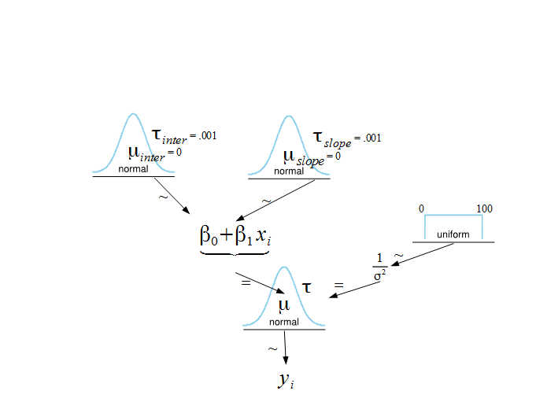
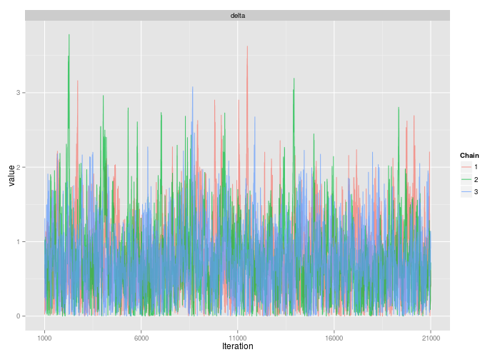

##


## Can SES predict math achievement?

## Can SES predict math achievement?
- variables: math ability, socio-economic status

## Can SES predict math achievement?
- variables: math ability, socio-economic status
- N = 7185 pupils across 160 schools


## aggregating


## a closer look ...


## variant of Simpson's paradox
- what holds true on the group level need not be true on the individual level

## variant of Simpson's paradox
- what holds true on the group-level need not be true on the individual level
- need to take both into account

## variant of Simpson's paradox
- what holds true on the group-level need not be true on the individual level
- need to take both into account
- leads to hierarchical modeling

# Building hierarchical models

## Model with fixed effects

$$Y_{i} = \beta_0 + \beta_1 cses_i + \varepsilon_{i}$$


## Bayesian Model specification 


## Bayesian Model specification 


## Bayesian Model specification 


## Bayesian Model specification  


## Bayesian Model specification 


## Bayesian Model specification 



## JAGS Output

```{r, eval = FALSE}
        Mean      SD 
b0    12.762 0.08003 
b1     2.192 0.12087 
sigma  6.725 0.05648 

```

## Model with random Intercept for every school

$$Y_{ij} = \beta_0 + \beta_1 cses_i + \nu_{0i} + \varepsilon_{ij}$$


## Bayesian Model specification 


## Bayesian Model specification 


## Bayesian Model specification 


## JAGS Output
```{r, eval = FALSE}
               Mean        SD 
b0[1]      9.955816 0.8507069 
b0[2]     13.372271 1.0925979 
b0[3]      8.076121 0.8420225 
b0[4]     15.557423 1.2288069 
b0[5]     13.107298 0.8414050 
b0[6]     11.427264 1.0153226 
b0[7]     10.140683 1.0704554 
b0[8]     18.973798 0.9577321 
...
b1         2.192245 0.10753146 
mu.int    12.656230 0.24356510 
sigma      6.085708 0.05064550 
sigma.int  0.117515 0.01433764 

```

## Model with random intercept and random slope

$$Y_{ij} = \beta_0 + \beta_1 cses_i + \nu_{0i} + \nu_{1i} +
\varepsilon_{ij}$$


## Bayesian Model specification 


## Bayesian Model specification 


## Bayesian Model specification 


## JAGS Output

```{r, eval = FALSE}
                  Mean        SD 
b0[1]         9.986826 0.8547047 
b0[2]        13.422617 1.1352827 
...
b1[158]      2.4861617 0.75520371 
b1[159]      2.5727856 0.72138232 
b1[160]      2.0203291 0.70894152 
mu.int      12.6357940 0.24790906 
mu.slope     2.1753626 0.12624520 
sigma        6.0597152 0.05286105 
sigma.int    2.9698435 0.19077038 
sigma.slope  0.8257171 0.16246617 

```

# Comparing hierarchical models


## DIC as possible candidate
- computationally more feasible

## DIC as possible candidate
- computationally more feasible
- Bayesian analog to AIC designed for hierarchical models

## DIC as possible candidate
- computationally more feasible
- Bayesian analog to AIC designed for hierarchical models
- Accounts for flexibility of priors: penalizes more flexible models more than those with more constrained

## DIC as possible candidate
- computationally more feasible
- Bayesian analog to AIC designed for hierarchical models
- Accounts for flexibility of priors: penalizes more flexible models more than those with more constrained
- tends to favour the more complex model (like AIC; also inconsistent)

## Comparing Models with DIC
Model 1: $Y_{i} = \beta_0 + \beta_1 cses_i + \varepsilon_{i}$
```{r, eval = FALSE}
Mean deviance:  47777 
penalty 3.134 
Penalized deviance: 47781 
```

## Comparing Models with DIC
Model 1: $Y_{i} = \beta_0 + \beta_1 cses_i + \varepsilon_{i}$
```{r, eval = FALSE}
Mean deviance:  47777 
penalty 3.134 
Penalized deviance: 47781 
```

Model 2: $Y_{ij} = \beta_0 + \beta_1 cses_i + \nu_{0i} + \varepsilon_{ij}$
```{r, eval = FALSE}
Mean deviance:  46339 
penalty 147.7 
Penalized deviance: 46486 
```

## Comparing Models with DIC
Model 1: $Y_{i} = \beta_0 + \beta_1 cses_i + \varepsilon_{i}$
```{r, eval = FALSE}
Mean deviance:  47777 
penalty 3.134 
Penalized deviance: 47781 
```

Model 2: $Y_{ij} = \beta_0 + \beta_1 cses_i + \nu_{0i} + \varepsilon_{ij}$
```{r, eval = FALSE}
Mean deviance:  46339 
penalty 147.7 
Penalized deviance: 46486 
```

Model 3: $Y_{ij} = \beta_0 + \beta_1 cses_i + \nu_{0i} + \nu_{1i} + \varepsilon_{ij}$
```{r, eval = FALSE}
Mean deviance:  46279 
penalty 190.7 
Penalized deviance: 46470 
```

## Comparing Models with DIC weights
- use the same formula for AIC weights (see @wagenmakers2004aic), but without the $\frac{1}{2}$ in the exponent

## Comparing Models with DIC weights
- use the same formula for AIC weights (see @wagenmakers2004aic), but without the $\frac{1}{2}$ in the exponent
- $\vartriangle_i (DIC) = DIC_i - \text{min} DIC$

## Comparing Models with DIC weights
- use the same formula for AIC weights (see @wagenmakers2004aic), but without the $\frac{1}{2}$ in the exponent
- $\vartriangle_i (DIC) = DIC_i - \text{min} DIC$
- $w_i(DIC) = \frac{e^{-\vartriangle_i (DIC)}}{\sum\limits_{k=1}^K e^{-\vartriangle_{k}(DIC)}}$

## Comparing Models with DIC weights
- use the same formula for AIC weights (see @wagenmakers2004aic), but without the $\frac{1}{2}$ in the exponent
- $\vartriangle_i (DIC) = DIC_i - \text{min} DIC$
- $w_i(DIC) = \frac{e^{-\vartriangle_i (DIC)}}{\sum\limits_{k=1}^K e^{-\vartriangle_{k}(DIC)}}$
- interpretation: model is the best model given the data _and_ the set of candidate models

## random intercept versus random slope
```{r, eval = FALSE}
dic_weights(dic_samples, which = c('rint', 'rslope'))

Inf
```

## random intercept & random slope versus random intercept
```{r, eval = FALSE}
dic_weights(dic_samples, which = c('maximal', 'rint'))

33488160
```

## Comparing Models with BIC
- fit the model using _lme4_

## Comparing Models with BIC
- fit the model using _lme4_
- approximate the Bayes factor via BIC [@wagenmakers2007practical]

## Comparing Models with BIC
- fit the model using _lme4_
- approximate the Bayes factor via BIC [@wagenmakers2007practical]
- $\text{BIC} = -2 \log p(\theta|y) + k  \log n$

## Comparing Models with BIC
- fit the model using _lme4_
- approximate the Bayes factor via BIC [@wagenmakers2007practical]
- $\text{BIC} = -2 \log p(\theta|y) + k  \log n$
- $BF_{01} = \exp{\frac{BIC_1 - BIC_0}{2}}$

## random intercept versus random slope
```{r, eval = FALSE}
BF01_bic(freq$rslope, freq$rint)

3.243075e+228
```

## random intercept versus random intercept & slope
```{r, eval = FALSE}
BF01_bic(freq$maximal, freq$rint)

64.27706 # rint over maximal (!!)
```

## random intercept versus random intercept & slope
```{r, eval = FALSE}
BF01_bic(freq$maximal, freq$rint)

64.27706 # rint over maximal (!!)
```

- apparently the BIC Bayes factor approximation yields the opposite result as the DICw

## random intercept versus random intercept & slope
```{r, eval = FALSE}
BF01_bic(freq$rint, freq$maximal)

64.27706 # rint over maximal (!!)
```

- apparently the BIC Bayes factor approximation yields the opposite result as the DICw
- a classical test is inline with the DICw

## classical test
```{r, eval = FALSE}
Data: dat
Models:
freq$rint: mathach ~ cses + (1 | school)
freq$maximal: mathach ~ cses + (cses | school)
             Df   AIC   BIC logLik deviance  Chisq Chi Df Pr(>Chisq)   
freq$rint     4 46728 46756 -23360    46720                            
freq$maximal  6 46723 46764 -23356    46711 9.4331      2   0.008946 **
---
Signif. codes:  0 ‘***’ 0.001 ‘**’ 0.01 ‘*’ 0.05 ‘.’ 0.1 ‘ ’ 1
```

## classical test
```{r, eval = FALSE}
Data: dat
Models:
freq$rint: mathach ~ cses + (1 | school)
freq$maximal: mathach ~ cses + (cses | school)
             Df   AIC   BIC logLik deviance  Chisq Chi Df Pr(>Chisq)   
freq$rint     4 46728 46756 -23360    46720                            
freq$maximal  6 46723 46764 -23356    46711 9.4331      2   0.008946 **
---
Signif. codes:  0 ‘***’ 0.001 ‘**’ 0.01 ‘*’ 0.05 ‘.’ 0.1 ‘ ’ 1
```

- sorry for the p-value!

## classical test
```{r, eval = FALSE}
Data: dat
Models:
freq$rint: mathach ~ cses + (1 | school)
freq$maximal: mathach ~ cses + (cses | school)
             Df   AIC   BIC logLik deviance  Chisq Chi Df Pr(>Chisq)   
freq$rint     4 46728 46756 -23360    46720                            
freq$maximal  6 46723 46764 -23356    46711 9.4331      2   0.008946 **
---
Signif. codes:  0 ‘***’ 0.001 ‘**’ 0.01 ‘*’ 0.05 ‘.’ 0.1 ‘ ’ 1
```

- sorry for the p-value!
- it pains me at least as much as it pains you ;)


## Model Interpretation
$Y_{ij} = \beta_0 + \beta_1 cses_i + \nu_{0i} + \nu_{1i} + \varepsilon_{ij}$

```{r, eval = FALSE}
                                   95% Highest Density Interval
              Mean        SD         lower     higher
b0[1]         9.986826 0.8547047 
b0[2]        13.422617 1.1352827 
b0[3]         8.035897 0.8398268 
...
b1[158]      2.4861617 0.75520371 
b1[159]      2.5727856 0.72138232 
b1[160]      2.0203291 0.70894152 

mu.int      12.6357940 0.24790906 12.17682  13.11603
mu.slope     2.1753626 0.12624520 1.948548  2.442388
sigma        6.0597152 0.05286105 5.956384  6.149032 
sigma.int    2.9698435 0.19077038 2.626246  3.268999
sigma.slope  0.8257171 0.16246617 0.5430283 1.127743
```

## Model Interpretation

- CSES is positively related to mathematical achievement
- This relationship differs across schools


## testing nested models
- use Savage-Dickey density ratio (more on that later)

## testing nested models
- use Savage-Dickey density ratio (more on that later)
- test if catholic schools differ from public schools

## testing nested models
- use Savage-Dickey density ratio (more on that later)
- test if catholic schools differ from public schools
```{r, eval = FALSE}
BF01_bic(freq$maximal, freq$maxsector)

200507890

savage_dickey(sector_delta, prior = dcauchy(0))

60719.16
```


## intermediate conclusion
- BIC Bayes factor approximation is weird for hierarchical models

## intermediate conclusion
- BIC Bayes factor approximation is weird for hierarchical models
- DIC is like AIC (favours complex models, inconsistent)

##


##


# Hierarchical modeling in experimental psychology

## experimental psychology
- trials are _nested_ within participants

## experimental psychology
- trials are _nested_ within participants
- experimental effect probably isn't the same for every participant

## simple experiment
- 2 conditions, within-subject

## simple experiment
- 2 conditions, within-subject
- $\alpha_i$ = $\phi_{exp}$ - $\phi_{base}$

## hyperpriors & random effects
- $\phi_{base} \sim N(\mu_{\phi}, \sigma_{\phi}^2)$ 

## hyperpriors & random effects
- $\phi_{base} \sim N(\mu_{\phi}, \sigma_{\phi}^2)$ 
- $\alpha_{i} \sim N(\mu_{\alpha}, \sigma_{\alpha}^2)$

## hyperpriors & random effects
- $\phi_{base} \sim N(\mu_{\phi}, \sigma_{\phi}^2)$ 
- $\alpha_{i} \sim N(\mu_{\alpha}, \sigma_{\alpha}^2)$
- $\mu_{\phi}$, $\sigma_{\phi}$, $\sigma_{\alpha}$ are given uninformative priors

## hyperpriors & random effects
- $\phi_{base} \sim N(\mu_{\phi}, \sigma_{\phi}^2)$ 
- $\alpha_{i} \sim N(\mu_{\alpha}, \sigma_{\alpha}^2)$
- $\mu_{\phi}$, $\sigma_{\phi}$, $\sigma_{\alpha}$ are given uninformative priors
- $\mu_{\alpha} = \delta \times \sigma_{\alpha}$

## default prior on effect size
- $\delta = \frac{\mu_{\alpha}}{\sigma_{\alpha}}$
- $\delta \sim \mathrm{Cauchy}(s = \frac{\sqrt{2}}{2})$
- see e.g. @rouder2012regression


## packages used
```{r, message = FALSE}
library('rjags') # interface with JAGS

library('coda') # MCMC diagnostics

library('ggmcmc') # nice plots

library('polspline') # get height of posterior
```
- for details, see accompanying R code


## 


## convergence I
```{r, message = FALSE, eval = FALSE}
ggs_traceplot(ggs(samples))
```



## convergence I


## Gelman & Rubin's $\hat R$
```{r, message = FALSE, eval = FALSE}
gelman.diag(samples)
```


##


## posterior of $\delta$
```{r, message = FALSE, eval = FALSE}
ggs_density(ggs(samples))
```


## posterior of $\delta$
- we are not interested in estimating things that may or may not exist

## posterior of $\delta$
- we are not interested in estimating things that may or may not exist
- parameter testing logically precedes parameter estimation

## Savage-Dickey density ratio
$BF_{01} = \frac{p(D|H_0)}{p(D|H_1)} = \frac{p(\delta \, = \, 0|D, H_1)}{p(\delta \, = \, 0|H_1)}$


## sensitivity analysis
```{r, message = FALSE, echo = FALSE}
library('ggplot2')

scale  <- function(x) dcauchy(x, scale = sqrt(2) / 2)

ggplot(data.frame(x = c(-6, 6)), aes(x)) +
     labs(x = "values", y = "density") +
     stat_function(fun = dnorm, aes(colour="Normal")) +
     stat_function(fun = dcauchy, aes(colour="Cauchy(s = 1)")) + 
     stat_function(fun = scale, aes(colour="Cauchy(s = 0.707)")) + 
     scale_colour_manual("priors",
                         breaks=c("Normal","Cauchy(s = 1)", "Cauchy(s = 0.707)"),
                         values=c("green","blue", "red"))
```

## Savage-Dickey
```{r, message = FALSE, eval = FALSE}
library('polspline')

savage_dickey <- function(prior) {
  fit.posterior <- logspline(samples, lbound = 0)
  posterior <- dlogspline(0, fit.posterior)
  BF01 <- posterior / prior
  1 / BF01
}
```

##


## ''informative'' prior
```{r, message = FALSE, eval = FALSE}
1 / savage_dickey(prior = dcauchy(0))

3.56
```

## diffuse prior
```{r, message = FALSE, eval = FALSE}
savage_dickey(prior = dunif(1, 0, 1000000))

Inf
```

## diffuse prior
```{r, message = FALSE, eval = FALSE}
savage_dickey(prior = dunif(1, 0, 1000000))

Inf
```

- Lindley's Paradox [@lindley1957statistical; @degroot1982lindley]

## diffuse prior
```{r, message = FALSE, eval = FALSE}
savage_dickey(prior = dunif(1, 0, 1000000))

Inf
```

- Lindley's Paradox [@lindley1957statistical; @degroot1982lindley]
- diffuse priors should not be used for hypothesis testing since they lead to unbounded support for $H_0$

## benefits of hierarchical modeling
- simultanously model group- and individual-level effects
- shrinkage
- relaxing assumptions (unbalanced designs, dependencies, etc.)
- many, many more; barely scratching the surface

## benefits of Bayesian hierarchical modeling
- natural to think about the group-level in terms of hyperpriors
- just ''turning the handle'' (no REML / ML etc.)


# Appendix

## accompanying R code / appendix


## note on hierarchical t-test
- code is in the _ttest/_ directory, adapted from @wagenmakers2010bayesian
- since we work with binary data, we need to model it accordingly
- that is, model the _probit_ of the response
- using ANOVA (with transformations) would lead to spurious results [@jaeger2008categorical]

## model comparison: sanity check
- use titanic survivor data and logistic regression
- compare simulated uniform covariate with Savage-Dickey and BIC Bayes factor
- see _comparison/sanity_

## model comparison: hierarchical models
- compare random effects with DIC weights and BIC Bayes factor
- additionally compare fixed effects with Savage-Dickey
- see _comparison/hierarchical/_

## lme4 BIC issues
- in lme4 _n_ is always the number of data points
- however, each level has it's own _n_
- e.g. 160 schools. test on this level has _n_ = 160
- e.g. 7185 pupils, test on this level has _n_ = 7185
- also, $k$ is not a good penalty for model complexity

## references